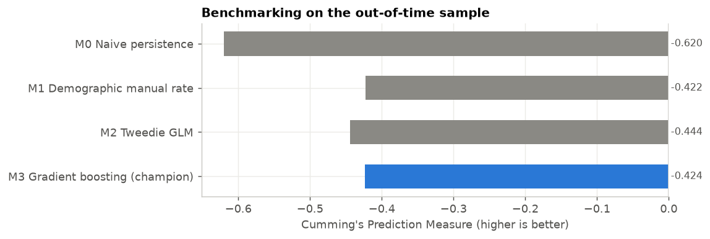
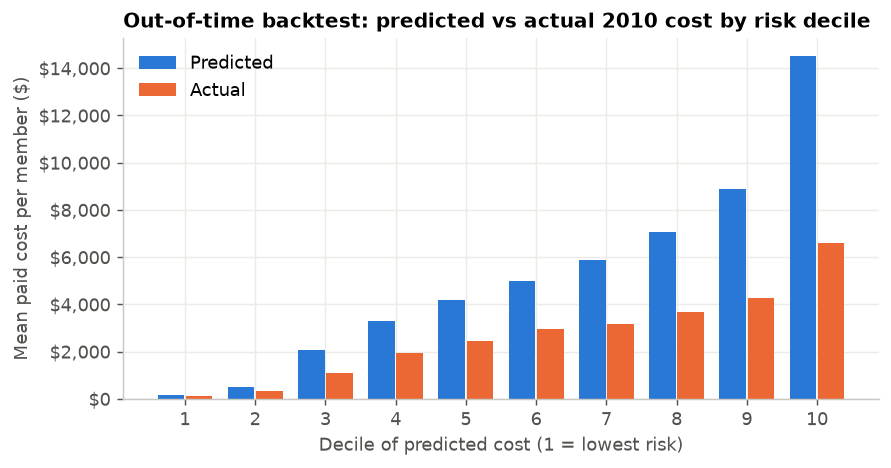
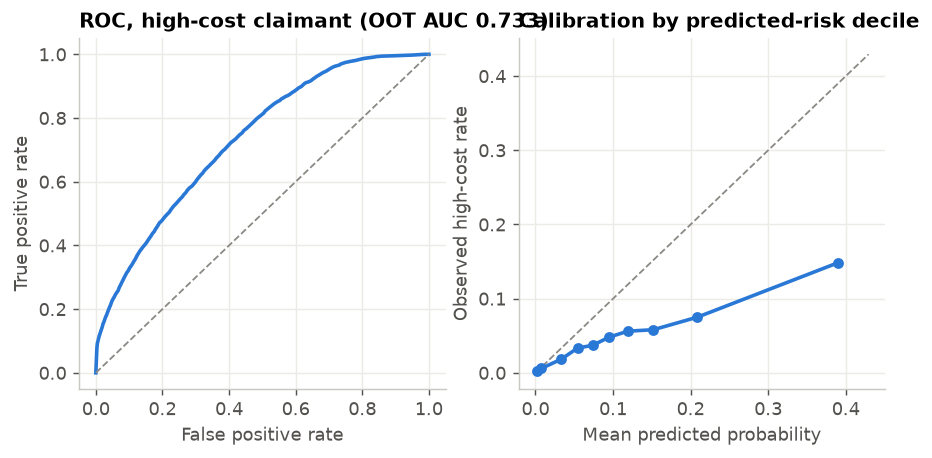
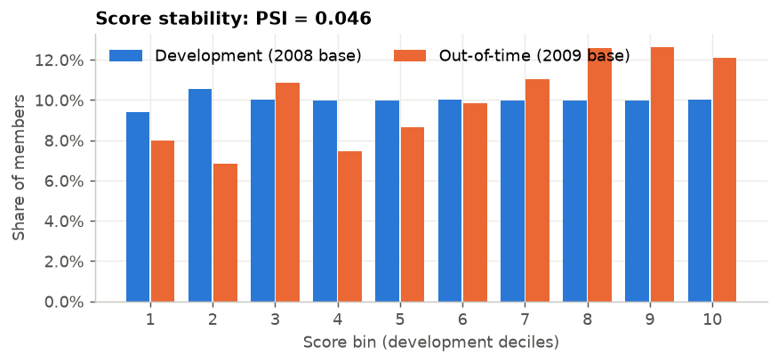
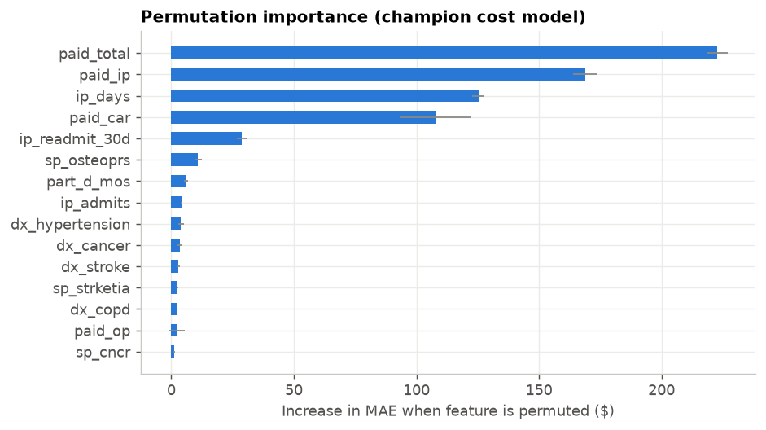
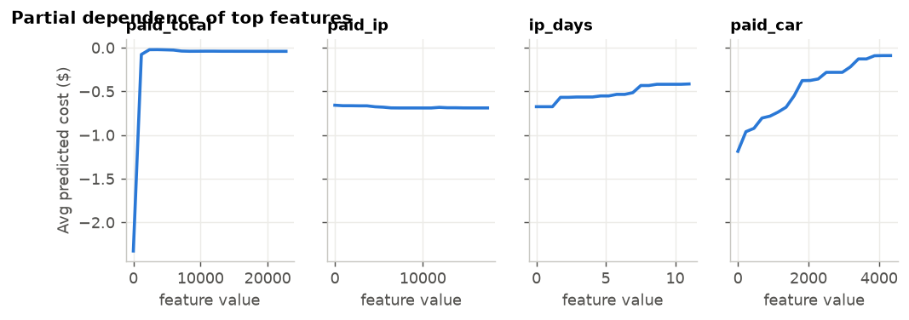
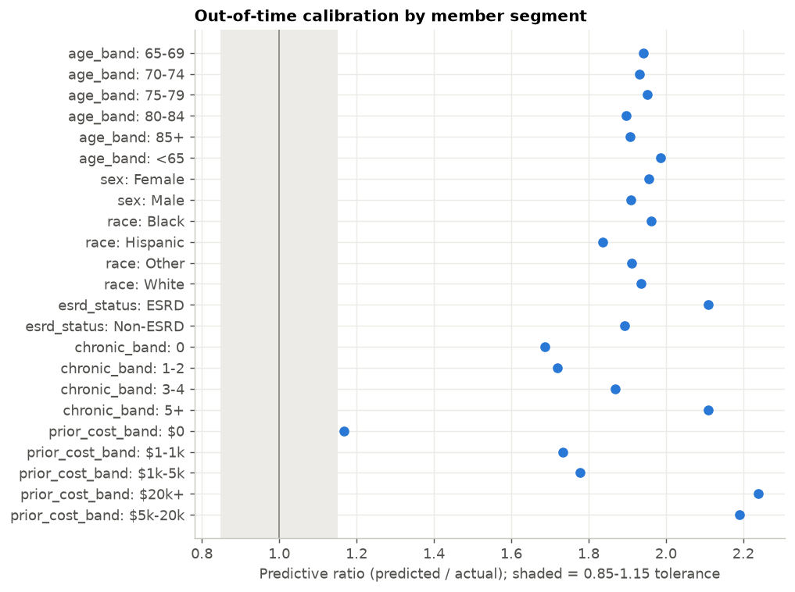

# Model Validation Report
## Medicare Prospective Cost Model & High-Cost Claimant Classifier

| | |
|---|---|
| **Model** | Next-year Medicare paid-cost model (Poisson gradient boosting) + high-cost claimant classifier |
| **Model owner (developer)** | Healthcare Analytics - Predictive Modelling |
| **Validator** | Independent Model Validation (second line) |
| **Data** | CMS 2008-2010 Data Entrepreneurs' Synthetic Public Use File (DE-SynPUF), Sample 1 |
| **Validation date** | 2026-10-06 |
| **Overall rating** | **Needs improvement - conditionally fit for use with compensating controls** |

## 1. Executive summary

The model predicts each Medicare fee-for-service beneficiary's **total Medicare paid cost in the next calendar year**
(inpatient + outpatient + carrier) from the current year's demographics, coverage, chronic conditions, utilisation and
cost history. A companion classifier flags likely **high-cost claimants** (top 10% of next-year cost,
threshold $12,030). Intended uses: medical cost forecasting / budget planning, care-management targeting and
actuarial risk stratification.

**Key results (out-of-time backtest, features 2009 -> actual 2010 cost, n = 106,186):**

| Metric | Value | 95% bootstrap CI |
|---|---|---|
| R-squared (cost) | -0.251 | -0.282 - -0.221 |
| Cumming's Prediction Measure | -0.424 | -0.441 - -0.406 |
| Predictive ratio (predicted / actual) | 1.935 | 1.914 - 1.958 |
| Share of actual cost in top-10% predicted | 24.8% | |
| High-cost claimant AUC | 0.733 | 0.726 - 0.740 |
| High-cost lift in top decile | 3.08x | |
| Score PSI (development vs OOT) | 0.046 | |

**Findings:** 1 High, 2 Medium, 5 Low - see Section 10.

## 2. Model purpose, scope and design

* **Unit of analysis:** beneficiary-year. **Target:** sum of `MEDREIMB_IP + MEDREIMB_OP + MEDREIMB_CAR` in year t+1.
* **Development sample:** base year 2008 -> outcome 2009, 70/30 random split (train 73,271 / in-time test 31,403).
* **Out-of-time (OOT) sample:** base year 2009 -> outcome 2010 (106,186 members), never used in fitting.
* **Models:** two actuarial benchmarks (trended persistence, credibility-weighted demographic manual rate), an interpretable
  Tweedie GLM (log link, p = 1.5) and the champion Poisson-loss histogram gradient boosting model. Classifier: logistic
  regression challenger vs gradient boosting champion.
* **Features (44):** age, sex, ESRD, Part A/B/D/HMO coverage months, 11 CMS Chronic Condition Warehouse flags,
  prior-year paid cost by setting and beneficiary liability, inpatient admits/days/30-day readmissions, outpatient & ED visits,
  distinct providers, and 12 ICD-9 clinical condition categories built in SQL (`sql/02_claims_features.sql`).
* **Excluded by design:** race (used only for disparity testing) and state (geographic proxy risk).

## 3. Data and population

Source tables were loaded to SQLite and transformed with version-controlled SQL (`sql/`). Population waterfall:

|   step | rule                                        |   2008 |   2009 |
|-------:|:--------------------------------------------|-------:|-------:|
|      1 | All beneficiaries in base-year summary file | 116352 | 114538 |
|      2 | Alive at end of base year                   | 114538 | 112754 |
|      3 | + Part A or B coverage in base year         | 109945 | 106867 |
|      4 | + Present in next-year summary file         | 109945 | 106867 |
|      5 | + Part A or B coverage in next year (final) | 104674 | 106186 |

### 3.1 Data quality testing

| check_id   | category       | description                                                    |    observed |   threshold | status   |
|:-----------|:---------------|:---------------------------------------------------------------|------------:|------------:|:---------|
| DQ-01      | Volume         | Beneficiary records in 2008 summary file                       | 116352.0000 |      0.0000 | INFO     |
| DQ-02      | Volume         | Beneficiary records in 2009 summary file                       | 114538.0000 |      0.0000 | INFO     |
| DQ-03      | Volume         | Beneficiary records in 2010 summary file                       | 112754.0000 |      0.0000 | INFO     |
| DQ-04      | Uniqueness     | Duplicate beneficiary-year keys                                |      0.0000 |      0.0000 | PASS     |
| DQ-05      | Uniqueness     | Duplicate inpatient claim keys (CLM_ID+SEGMENT)                |      0.0000 |      0.0000 | PASS     |
| DQ-06      | Uniqueness     | Duplicate outpatient claim keys (CLM_ID+SEGMENT)               |      0.0000 |      0.0000 | PASS     |
| DQ-07      | Completeness   | Share of beneficiaries missing birth date                      |      0.0000 |      0.0000 | PASS     |
| DQ-08      | Validity       | Share with implausible age (<18 or >110)                       |      0.0000 |      0.0010 | PASS     |
| DQ-09      | Validity       | Share of bene-years with negative Medicare reimbursement       |      0.0007 |      0.0010 | PASS     |
| DQ-10      | Validity       | Share of inpatient claims with negative payment                |      0.0008 |      0.0010 | PASS     |
| DQ-11      | Validity       | Share of inpatient claims with through-date before from-date   |      0.0000 |      0.0010 | PASS     |
| DQ-12      | Completeness   | Share of outpatient claims missing service from-date           |      0.0142 |      0.0100 | WARN     |
| DQ-13      | Validity       | Share of inpatient claims outside 2008-2010 window             |      0.0034 |      0.0100 | PASS     |
| DQ-14      | Completeness   | Share of outpatient claims missing principal diagnosis         |      0.0071 |      0.0200 | PASS     |
| DQ-15      | Integrity      | Share of inpatient claimants not found in any beneficiary file |      0.0000 |      0.0010 | PASS     |
| DQ-16      | Consistency    | Share of inpatient claims (decedents) dated after death        |      0.0000 |      0.0100 | PASS     |
| DQ-17      | Reconciliation | Max |IP claims total / summary MEDREIMB_IP - 1| across years   |      0.0523 |      0.0500 | WARN     |

Inpatient claim-to-summary reconciliation (claims `CLM_PMT_AMT` vs summary `MEDREIMB_IP`):

|       yr |    summary_ip |     claims_ip |   ratio_claims_to_summary |
|---------:|--------------:|--------------:|--------------------------:|
| 2008.000 | 257624360.000 | 257732880.000 |                     1.000 |
| 2009.000 | 250842760.000 | 244810270.000 |                     0.976 |
| 2010.000 | 139989740.000 | 132669330.000 |                     0.948 |

## 4. Conceptual soundness

* **Negative reimbursements:** 15 beneficiary-years had a negative net
  next-year Medicare reimbursement (payment adjustments). The target was floored at $0 for modelling; prior-year cost
  features are floored the same way. See DQ-09.
* **Target definition** is consistent with prospective risk adjustment practice (SOA risk-adjuster studies): concurrent-year
  information predicts the following year's cost. No outcome-year information enters the feature set.
* **Leakage review:** forbidden columns in model = `[]`; highest single feature
  correlation with target = `paid_car` (0.470) - no evidence of leakage.
* **Loss function:** Poisson / Tweedie deviance is appropriate for non-negative, zero-inflated, right-skewed cost data and
  preserves the aggregate mean (balance property), which matters for budgeting.
* **Monotonicity:** mean prediction is monotonically increasing in chronic-condition count:

|   n_chronic_capped |   mean_pred |
|-------------------:|------------:|
|                  0 |        1014 |
|                  1 |        3322 |
|                  2 |        4523 |
|                  3 |        5565 |
|                  4 |        7002 |
|                  5 |        8206 |
|                  6 |        9619 |
|                  7 |       10945 |
|                  8 |       12723 |

## 5. Outcome analysis

### 5.1 Cost model - benchmarking across samples

| model                           | sample         |     R2 |    CPM |      MAE |   Predictive_ratio |   Gini |   Top10_cost_capture |
|:--------------------------------|:---------------|-------:|-------:|---------:|-------------------:|-------:|---------------------:|
| M0 Naive persistence            | Train          | -0.681 |  0.011 | 4890.867 |              1.089 |  0.580 |                0.267 |
| M0 Naive persistence            | Test (in-time) | -0.721 |  0.006 | 4836.284 |              1.111 |  0.584 |                0.274 |
| M0 Naive persistence            | OOT 2009->2010 | -2.073 | -0.620 | 4723.924 |              1.950 |  0.442 |                0.192 |
| M1 Demographic manual rate      | Train          |  0.055 |  0.050 | 4696.698 |              0.967 |  0.238 |                0.278 |
| M1 Demographic manual rate      | Test (in-time) |  0.060 |  0.044 | 4653.088 |              0.987 |  0.252 |                0.294 |
| M1 Demographic manual rate      | OOT 2009->2010 | -0.116 | -0.422 | 4146.560 |              1.747 |  0.191 |                0.199 |
| M2 Tweedie GLM                  | Train          |  0.256 |  0.246 | 3726.681 |              1.000 |  0.678 |                0.305 |
| M2 Tweedie GLM                  | Test (in-time) |  0.273 |  0.244 | 3681.595 |              1.014 |  0.682 |                0.313 |
| M2 Tweedie GLM                  | OOT 2009->2010 | -0.234 | -0.444 | 4210.552 |              1.953 |  0.537 |                0.240 |
| M3 Gradient boosting (champion) | Train          |  0.300 |  0.266 | 3626.317 |              1.002 |  0.697 |                0.320 |
| M3 Gradient boosting (champion) | Test (in-time) |  0.295 |  0.254 | 3629.249 |              1.016 |  0.692 |                0.320 |
| M3 Gradient boosting (champion) | OOT 2009->2010 | -0.251 | -0.424 | 4150.467 |              1.935 |  0.547 |                0.248 |

### 5.2 Decile backtest (OOT)

|   decile |         n |       pred_sum |    actual_sum |   mean_pred |   mean_actual |   predictive_ratio |
|---------:|----------:|---------------:|--------------:|------------:|--------------:|-------------------:|
|     1.00 | 10,619.00 |   1,696,479.33 |  1,323,380.00 |      159.76 |        124.62 |               1.28 |
|     2.00 | 10,619.00 |   5,263,464.83 |  3,545,860.00 |      495.66 |        333.92 |               1.48 |
|     3.00 | 10,618.00 |  21,777,496.72 | 11,514,240.00 |    2,051.00 |      1,084.41 |               1.89 |
|     4.00 | 10,619.00 |  35,059,297.72 | 20,688,150.00 |    3,301.56 |      1,948.22 |               1.69 |
|     5.00 | 10,618.00 |  44,350,736.37 | 25,984,700.00 |    4,176.94 |      2,447.23 |               1.71 |
|     6.00 | 10,619.00 |  52,813,043.25 | 31,286,140.00 |    4,973.45 |      2,946.24 |               1.69 |
|     7.00 | 10,618.00 |  62,437,825.63 | 33,758,830.00 |    5,880.38 |      3,179.40 |               1.85 |
|     8.00 | 10,619.00 |  74,999,550.71 | 38,937,460.00 |    7,062.77 |      3,666.77 |               1.93 |
|     9.00 | 10,618.00 |  94,111,557.28 | 45,340,730.00 |    8,863.40 |      4,270.18 |               2.08 |
|    10.00 | 10,619.00 | 154,346,813.77 | 70,194,530.00 |   14,534.97 |      6,610.28 |               2.20 |

### 5.3 High-cost claimant classifier

| model                           | sample         |   AUC |   Gini |    KS |   Brier |   Precision_top10 |   Lift_top10 |   HL_pvalue |
|:--------------------------------|:---------------|------:|-------:|------:|--------:|------------------:|-------------:|------------:|
| C1 Logistic regression          | Train          | 0.799 |  0.599 | 0.436 |   0.077 |             0.361 |        3.604 |       0.000 |
| C1 Logistic regression          | Test (in-time) | 0.798 |  0.596 | 0.431 |   0.076 |             0.358 |        3.641 |       0.000 |
| C1 Logistic regression          | OOT 2009->2010 | 0.730 |  0.460 | 0.316 |   0.053 |             0.144 |        2.977 |       0.000 |
| C2 Gradient boosting (champion) | Train          | 0.837 |  0.674 | 0.495 |   0.071 |             0.426 |        4.257 |       0.000 |
| C2 Gradient boosting (champion) | Test (in-time) | 0.800 |  0.600 | 0.435 |   0.074 |             0.367 |        3.731 |       0.062 |
| C2 Gradient boosting (champion) | OOT 2009->2010 | 0.733 |  0.465 | 0.318 |   0.053 |             0.149 |        3.076 |       0.000 |

## 6. Stability

Score PSI between in-time test and OOT = **0.046** (< 0.10 stable, 0.10-0.25 monitor, > 0.25 significant shift).

Top characteristic stability indices (CSI):

| feature        |   csi |
|:---------------|------:|
| part_d_mos     | 0.125 |
| op_visits      | 0.062 |
| n_providers    | 0.056 |
| log_paid_total | 0.052 |
| paid_total     | 0.052 |
| benres_total   | 0.047 |
| paid_op        | 0.046 |
| n_distinct_dx  | 0.038 |
| paid_car       | 0.035 |
| n_chronic      | 0.020 |

## 7. Sensitivity and robustness

**Input shocks (OOT, champion):**

| test                         |   mean_pred_change |
|:-----------------------------|-------------------:|
| Prior-year costs -10%        |             -0.041 |
| Prior-year costs +10%        |              0.043 |
| Prior-year costs +25%        |              0.103 |
| n_chronic +1 for all members |              0.028 |
| ip_admits +1 for all members |              0.017 |

**Seed, hyper-parameter and feature-ablation re-fits (OOT metrics):**

| test                         | group          |     R2 |    CPM |   Predictive_ratio |   Gini |
|:-----------------------------|:---------------|-------:|-------:|-------------------:|-------:|
| Seed 1                       | seed           | -0.255 | -0.425 |              1.938 |  0.547 |
| Seed 2                       | seed           | -0.248 | -0.424 |              1.933 |  0.546 |
| Seed 3                       | seed           | -0.247 | -0.422 |              1.932 |  0.547 |
| Seed 4                       | seed           | -0.249 | -0.418 |              1.925 |  0.546 |
| Seed 5                       | seed           | -0.239 | -0.412 |              1.919 |  0.547 |
| learning_rate=0.10           | hyperparameter | -0.259 | -0.423 |              1.937 |  0.548 |
| max_leaf_nodes=15            | hyperparameter | -0.251 | -0.424 |              1.935 |  0.547 |
| max_leaf_nodes=63            | hyperparameter | -0.257 | -0.416 |              1.923 |  0.545 |
| loss=squared_error           | hyperparameter | -0.237 | -0.430 |              1.939 |  0.544 |
| Drop prior-cost features     | ablation       | -0.246 | -0.433 |              1.918 |  0.512 |
| Drop claims-derived features | ablation       | -0.252 | -0.434 |              1.940 |  0.537 |
| Drop chronic-condition flags | ablation       | -0.247 | -0.424 |              1.935 |  0.545 |

## 8. Explainability

## 9. Segment calibration and fairness

| dimension       | level    |     n |   actual_mean |   pred_mean |   predictive_ratio |
|:----------------|:---------|------:|--------------:|------------:|-------------------:|
| age_band        | 65-69    | 20147 |      2290.716 |    4446.112 |              1.941 |
| age_band        | 70-74    | 21112 |      2475.800 |    4781.355 |              1.931 |
| age_band        | 75-79    | 17646 |      2671.379 |    5215.740 |              1.952 |
| age_band        | 80-84    | 14350 |      2926.113 |    5550.830 |              1.897 |
| age_band        | 85+      | 16475 |      3104.957 |    5920.728 |              1.907 |
| age_band        | <65      | 16456 |      2665.949 |    5292.971 |              1.985 |
| sex             | Female   | 59488 |      2682.651 |    5244.990 |              1.955 |
| sex             | Male     | 46698 |      2633.700 |    5028.959 |              1.909 |
| race            | Black    | 10922 |      2559.744 |    5021.638 |              1.962 |
| race            | Hispanic |  2471 |      2408.195 |    4420.931 |              1.836 |
| race            | Other    |  4338 |      2302.077 |    4401.901 |              1.912 |
| race            | White    | 88455 |      2698.315 |    5222.886 |              1.936 |
| esrd_status     | ESRD     | 10677 |      5265.278 |   11103.227 |              2.109 |
| esrd_status     | Non-ESRD | 95509 |      2370.003 |    4484.469 |              1.892 |
| chronic_band    | 0        | 30025 |       601.335 |    1014.308 |              1.687 |
| chronic_band    | 1-2      | 25508 |      2278.228 |    3918.854 |              1.720 |
| chronic_band    | 3-4      | 23478 |      3348.605 |    6257.621 |              1.869 |
| chronic_band    | 5+       | 27175 |      4702.386 |    9918.053 |              2.109 |
| prior_cost_band | $0       | 15657 |       155.355 |     181.273 |              1.167 |
| prior_cost_band | $1-1k    | 23850 |      1294.676 |    2245.098 |              1.734 |
| prior_cost_band | $1k-5k   | 42104 |      3281.310 |    5832.384 |              1.777 |
| prior_cost_band | $20k+    |  5153 |      6029.701 |   13497.159 |              2.238 |
| prior_cost_band | $5k-20k  | 19422 |      4120.908 |    9028.676 |              2.191 |

High-cost classifier disparity review (race is not a model input):

| dimension   | level    |     n |   event_rate |   AUC |   flag_rate_top10 |   TPR_top10 |
|:------------|:---------|------:|-------------:|------:|------------------:|------------:|
| race        | White    | 88455 |        0.049 | 0.728 |             0.102 |       0.304 |
| race        | Black    | 10922 |        0.047 | 0.752 |             0.103 |       0.355 |
| race        | Other    |  4338 |        0.042 | 0.760 |             0.075 |       0.306 |
| race        | Hispanic |  2471 |        0.047 | 0.760 |             0.074 |       0.233 |
| sex         | Male     | 46698 |        0.048 | 0.736 |             0.095 |       0.302 |
| sex         | Female   | 59488 |        0.049 | 0.730 |             0.104 |       0.312 |

## 10. Findings and recommendations

| id   | area                 | severity   | finding                                                             | evidence                                                                                                                                         | recommendation                                                                                            |
|:-----|:---------------------|:-----------|:--------------------------------------------------------------------|:-------------------------------------------------------------------------------------------------------------------------------------------------|:----------------------------------------------------------------------------------------------------------|
| F-01 | Data quality         | Low        | DQ-12: Share of outpatient claims missing service from-date         | Observed 0.0142 vs threshold 0.01                                                                                                                | Document root cause with data owner; add exclusion or correction rule and monitor in production.          |
| F-02 | Data quality         | Low        | DQ-17: Max |IP claims total / summary MEDREIMB_IP - 1| across years | Observed 0.0523 vs threshold 0.05                                                                                                                | Document root cause with data owner; add exclusion or correction rule and monitor in production.          |
| F-03 | Outcome analysis     | High       | Aggregate out-of-time calibration outside +/-5% tolerance           | OOT predictive ratio 1.935 (in-time 1.016); mean actual $2,661 vs predicted $5,150                                                               | Introduce an explicit annual cost-trend / calibration factor refreshed each year before use in budgeting. |
| F-04 | Outcome analysis     | Medium     | Material out-of-time deterioration in explanatory power             | R2 in-time 0.295 vs OOT -0.251                                                                                                                   | Investigate drivers (population shift, coding changes); consider re-training on pooled years.             |
| F-05 | Stability            | Low        | Feature distribution shift (CSI > 0.10)                             | part_d_mos=0.12                                                                                                                                  | Review whether shift is real (population/coding) or a data artefact; monitor quarterly.                   |
| F-06 | Outcome analysis     | Medium     | Subgroup mis-calibration (predictive ratio outside 0.85-1.15)       | age_band=65-69: PR 1.94; age_band=70-74: PR 1.93; age_band=75-79: PR 1.95; age_band=80-84: PR 1.90; age_band=85+: PR 1.91; age_band=<65: PR 1.99 | Add segment-level calibration or interaction terms; communicate known biases to model users.              |
| F-07 | Conceptual soundness | Low        | Synthetic data limits clinical credibility of relationships         | CMS DE-SynPUF perturbs and synthesises variables, weakening true clinical-cost associations; Carrier and Part D detail not used as features.     | Re-estimate and re-validate on production claims (with Carrier and PDE) before any business use.          |
| F-08 | Implementation       | Low        | Model monitoring plan required                                      | No production monitoring exists for this development model.                                                                                      | Monthly: PSI/CSI, predictive ratio by segment, HCC precision@10%; annual full re-validation.              |

## 11. Ongoing monitoring plan

| Metric | Frequency | Green | Amber | Red |
|---|---|---|---|---|
| Score PSI | Monthly | < 0.10 | 0.10 - 0.25 | > 0.25 |
| Feature CSI (top 10) | Monthly | < 0.10 | 0.10 - 0.25 | > 0.25 |
| Aggregate predictive ratio | Quarterly | 0.95 - 1.05 | 0.90 - 1.10 | outside |
| Segment predictive ratio (n >= 500) | Quarterly | 0.90 - 1.10 | 0.85 - 1.15 | outside |
| HCC AUC | Quarterly | >= dev - 0.02 | dev - 0.05 | below |
| Full re-validation | Annual / material change | | | |

## 12. Limitations

* CMS DE-SynPUF is a **synthetic** public-use file: values are perturbed and imputed to protect privacy, so clinical
  relationships are weaker than in production claims and absolute accuracy should not be compared with commercial risk models.
* Carrier (physician) and Part D event-level files are not used for features (only their annual totals via the summary file).
* Only one base year of history is available for the OOT window, limiting multi-year look-back features.

---
*Reproducible: `python run_pipeline.py` regenerates every number, table and figure in this report.*
